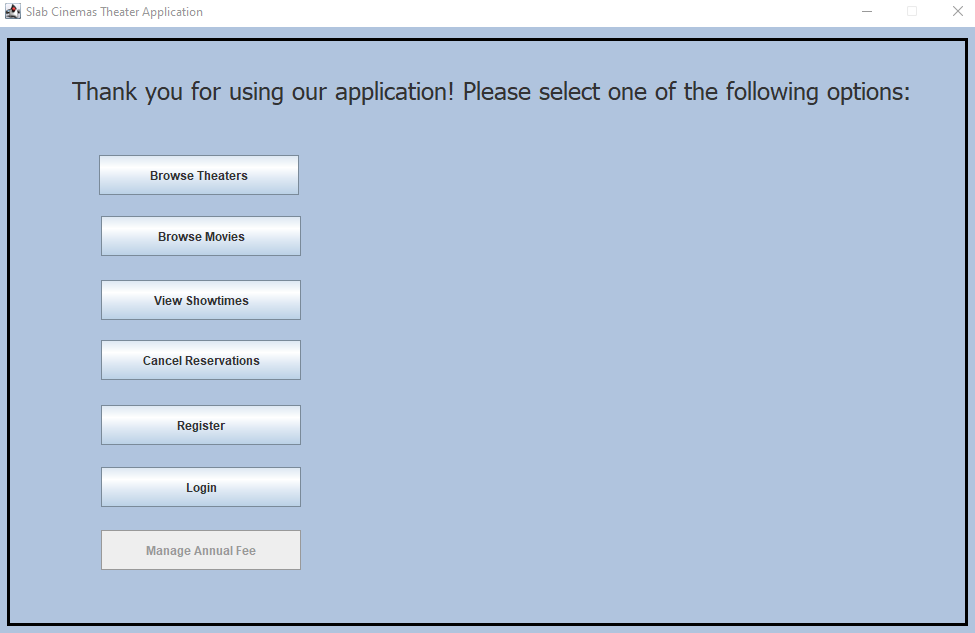
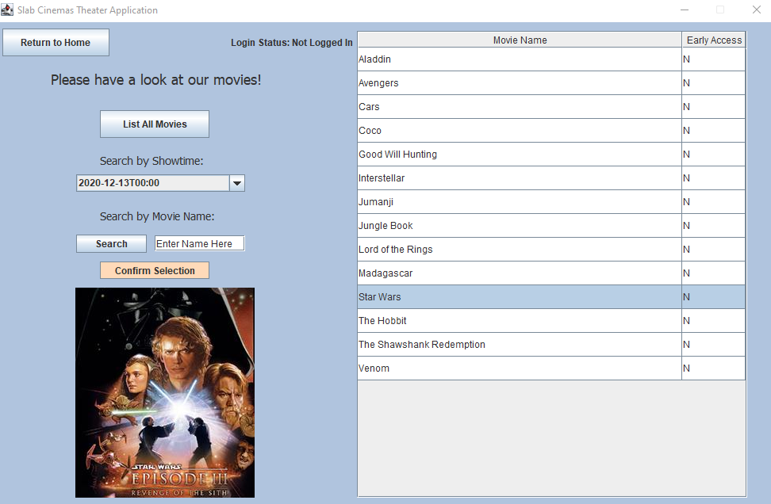
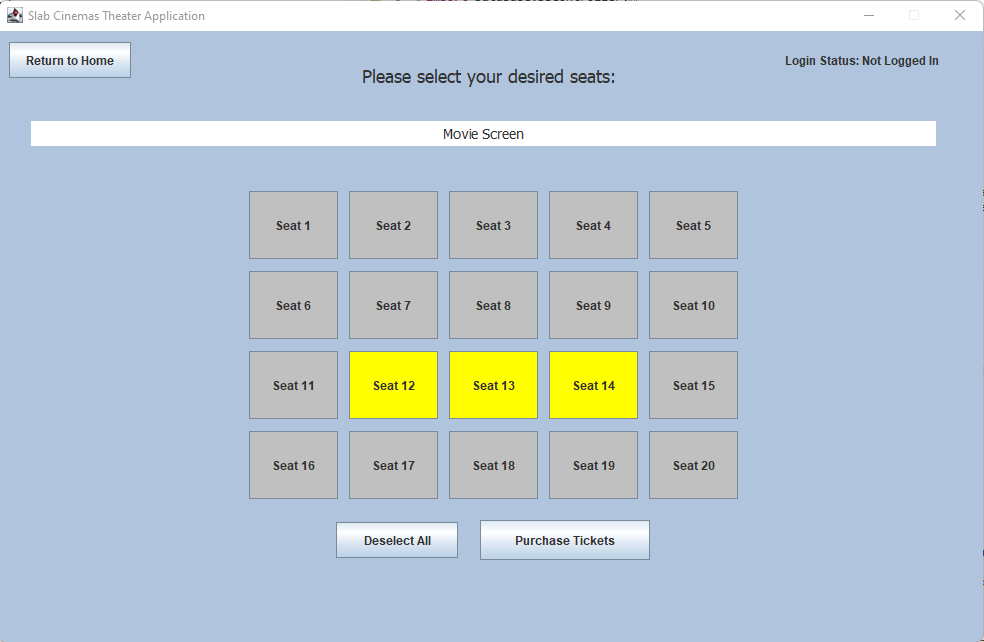

# Movie Theater Booking System (ENSF 619)

This project applies a number of software design patterns to build a movie theater booking system, including tasks such as viewing showtimes, selecting seats, and buying, refunding, and receiving tickets via email.

## How to Use

- Create theater database and import data from .csv files (table data import wizard in MySQL) located in DBFiles folder
- Run database server (if not running already)
- Modify DBCredentials.java file to connect to database
- Run MainController.java file

## Sample Screenshots

Main Menu:

Browse Movies:

Select Seats:

